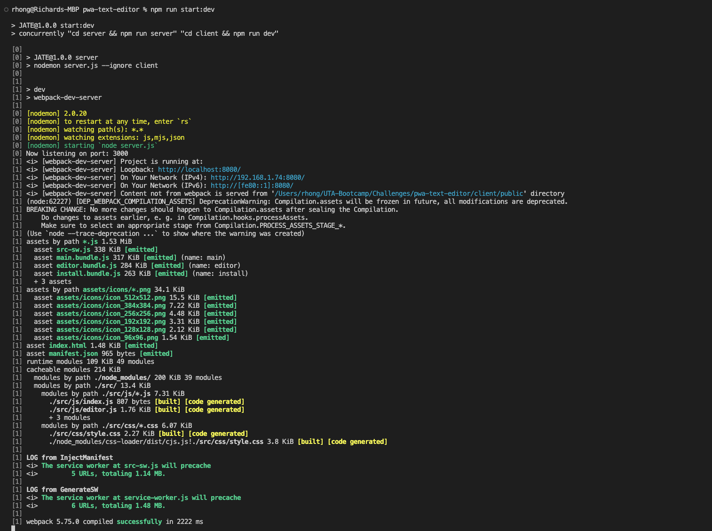
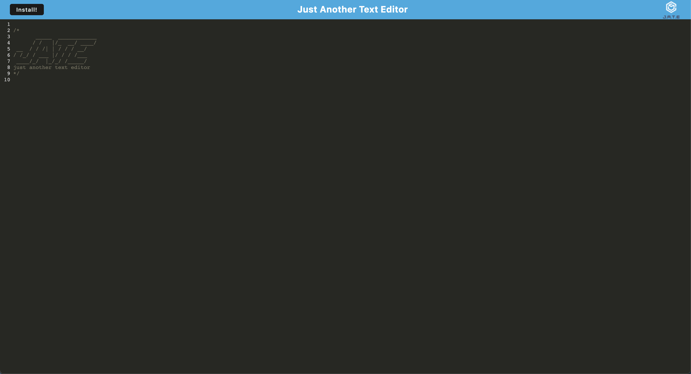

# PWA Text Editor

[](https://opensource.org/licenses/MIT)

## Description
This app takes a base code text editor and enhances it with service workers, a manifest.json file, and webpack bundling to create a Progressive Web Application.
Progressive Web Application itself is an adapatable design pattern with principles that focus on web performance optimization and take advantage of the user's browser capabilities to provide a native app experience on any device.

## Technologies
This app is separated with a client and server folder, each with its own package.json and dependencies/developer dependencies. The root package.json uses a combination of scripts and dependencies to automate the different installation steps meanwhile. For the root package. json: the following are used:
  * [Express](https://expressjs.com/) (version 4.17.1)
  * [if-env](https://github.com/ericclemmons/if-env) (version 1.0.4)
  * [nodemon](https://www.npmjs.com/package/nodemon) (version 2.0.04)
  * [concurrently](https://github.com/open-cli-tools/concurrently) (version 5.2.0)

The client folder package.json uses the following combination of dependencies/developer dependencies:
  * [babel](https://github.com/babel/babel) 
    - This includes @babel/core, @babel/plugin-transform-runtime, @babel/preset-env, and @babel/runtime
  * [babel-loader](https://github.com/babel/babel-loader) (version 8.2.2)
  * [css-loader](https://github.com/webpack-contrib/css-loader) (version 6.2.0)
  * [html-webpack-plugin](https://github.com/jantimon/html-webpack-plugin) (version 5.3.2)
  * [http-server](https://github.com/http-party/http-server) (version 0.11.1)
  * [style-loader](https://github.com/webpack-contrib/style-loader) (version 3.2.1)
  * [webpack](https://github.com/webpack/webpack) (version 5.51.1)
  * [webpack-cli](https://github.com/webpack/webpack-cli) (version 4.8.0)
  * [webpack-dev-server](https://github.com/webpack/webpack-dev-server) (version 4.0.0)
  * [webpack-pwa-manifest](https://github.com/arthurbergmz/webpack-pwa-manifest) (version 4.3.0)
  * [workbox-webpack-plugin](https://github.com/googlechrome/workbox) (version 6.2.4)
  * [code-mirror-themes](https://github.com/FarhadG/code-mirror-themes) (version 1.0.0)
  * [idb](https://github.com/jakearchibald/idb) (version 6.1.2)

The server folder package.json uses the following combination of dependencies/developer dependencies:
  * [Express](https://expressjs.com/) (version 4.17.1)
  * [nodemon](https://www.npmjs.com/package/nodemon) (version 2.0.04)


## Table of Contents
  - [Installation](#installation)
  - [Usage](#usage)
  - [Architecture](#architecture)
  - [Livesite](#livesite)
  - [Screenshot](#screenshot)
  - [License](#license)
  - [Questions](#questions)

## Installation

Upon cloning the github repository, the user should run the following command

```
npm install
```
This alone should automate the installation of all dependencies/developer dependencies needed for both the client and server folders. 

To ensure that everything was installed as expected, the root level package.json should have the following lines:

```
...
   "dependencies": {
    "express": "^4.17.1",
    "if-env": "^1.0.4"
  },
  "devDependencies": {
    "concurrently": "^5.2.0",
    "nodemon": "^2.0.4"
  }
```

The client folder package.json should have the following lines:
```
...
  "devDependencies": {
    "@babel/core": "^7.15.0",
    "@babel/plugin-transform-runtime": "^7.15.0",
    "@babel/preset-env": "^7.15.0",
    "@babel/runtime": "^7.15.3",
    "babel-loader": "^8.2.2",
    "css-loader": "^6.2.0",
    "html-webpack-plugin": "^5.3.2",
    "http-server": "^0.11.1",
    "style-loader": "^3.2.1",
    "webpack": "^5.51.1",
    "webpack-cli": "^4.8.0",
    "webpack-dev-server": "^4.0.0",
    "webpack-pwa-manifest": "^4.3.0",
    "workbox-webpack-plugin": "^6.2.4"
  },
  "dependencies": {
    "code-mirror-themes": "^1.0.0",
    "idb": "^6.1.2"
  }
```

The server folder package.json should have the following lines:
```
...
  "dependencies": {
        "express": "^4.17.1"
    },
  "devDependencies": {
      "nodemon": "^2.0.4"
  }
```

## Usage
After having run the ```npm install``` command, the user should run the following command while still at the root level:
```
npm run start:dev
```

After running the command, the user should expect to see something similar within his/her terminal:



Finally the user can now navigate to the url http://localhost:8080/

## Architecture
For this app, the majority of code for the text editor itself were in place; however the webpack configuration, manifest, and idb (indexed database) implementation for editor functionality were missing. The following were affected to get the app working and into a PWA state:
  * client folder
    - Here, the webpack configuation (client/webpack.config.js) was largely incomplete. After importing the appropriate plugins at the top of the file and creating the logic within module.exports, the webpack worked as expected.
    - Within both client/src/js/database.js and client/src/js/editor.js, the functionality of accounting for getting the previous state of the editor text and posting a new state was created. 
    - The client/src/js/install.js logic was implemented from scratch as well.

  * server folder
    - Server folder was working as expected and was unaffected

  * root level package.json
    - The scripts were missing which accounts for the automation of installing of dependencies and creating a dist file for the bundled js files. Scripts were created here to create the ease of convenience.

## Livesite
[Deployed on Heroku](https://rjh-pwa-text-editor.herokuapp.com/)

## Screenshot


## License
This app was licensed under the MIT License.

## Questions
Questions, comments, concerns? Send me an email at rhong24@gmail.com.


